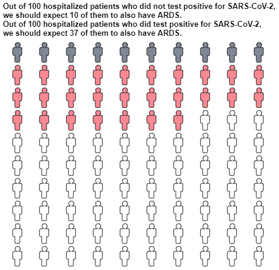

# Communicate Risk as Expected Frequencies

An unofficial Python version of the [RealRisk](https://realrisk.wintoncentre.uk/) calculator,
allowing Python scripts to automate the conversion of statistical risks to expected frequencies 
and plotting icon-arrays (isotype-grids) using an API.

## What are expected frequencies
Odds ratios and hazard ratios may be comfortable measures of association to obtain,
but they are not the easiest to interpret.   
Absolute risks are much easier to communicate to a general audience, 
and expected frequencies are a clearer way to present risks.  

Once we convert an odds-ratio of some desired risk-factor to absolute risk, 
we can ask how many people we expect to see in a hypothetical population of size _N_ (usually 100).  
Working with absolute risks allows us to see how many people 
without the risk-factor we expect to see in that population,
and how many individuals will be added with the risk-factor.

This formulation enables a clear visualization of the risk in a population
in the form of an isotype grid:  


### What you will need
In order to calculate expected frequencies you'll need:
1. A statistical measure of association. One of:
    1. Odds ratio (OR) - usually obtained by logistic regression
    1. Hazard ratio (HR) - usually obtained by CoxPH regression
    1. Risk ratio (RR) - also referred to as relative risk / rate ratio
    1. Percentage change
2. Baseline risk.  
   the fraction of individuals *without* the risk factor (i.e. in the control group) 
   that experienced the event (outcome) of interest.

## Usage
The minimum required to calculate risk as expected frequencies is:
```python
from expected_frequencies import expected_frequencies
baseline_risk = 10.2 / 100
odds_ratio = 5.21
result = expected_frequencies(baseline_risk, odds_ratio, "odds_ratio")
```
Which returns a `Result` object that includes:
1. Expected frequencies of the baseline (without risk-factor), and the exposed (with risk-factor) groups
1. An isotype-grid chart
1. A textual phrasing describing the results

There are two separate functions for generating only the plot or the textual phrasing:
```python
from expected_frequencies import plot_expected_frequencies, phrase_expected_frequencies
```

To generate the chart above run:
```python
from expected_frequencies import expected_frequencies
baseline_risk = 10.2 / 100
odds_ratio = 5.21
result = expected_frequencies(
    baseline_risk, odds_ratio, "odds_ratio",
    population_name="hospitalized patients",
    event_name="ARDS",
    risk_factor_name="test positive for SARS-CoV-2",
    plot_kwargs={"chart_width": 450, "chart_height": 380},
    plot_text=True
)
result.chart.show()
```

### Dependencies
The package is dependent on:
* Altair >= 4.1.0 (may also work with previous versions, but not tested)
