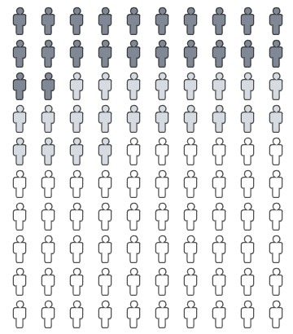
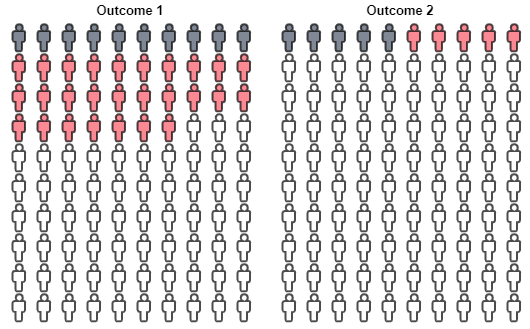
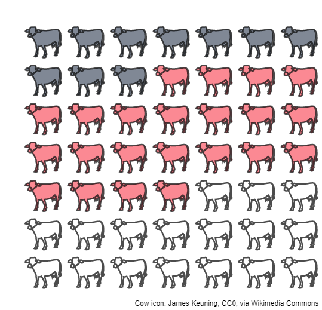

# Usage examples

## Main functionality
### Generate an icon array plot with overlaid text
```python
from expected_frequencies import expected_frequencies
baseline_risk = 10.2 / 100
odds_ratio = 5.21
result = expected_frequencies(
    baseline_risk, odds_ratio, "odds_ratio",
    population_name="hospitalized patients",
    event_name="ARDS",
    risk_factor_name="test positive for SARS-CoV-2",
    plot_kwargs={"chart_width": 450, "chart_height": 380},
    plot_text=True
)
print(result.text)
# Out of 100 hospitalized patients who did not test positive for SARS-CoV-2, we should expect 10 of them to also have ARDS.
# Out of 100 hospitalized patients who did test positive for SARS-CoV-2, we should expect 37 of them to also have ARDS.
result.chart.show()
```


Risk reduction looks slightly different:
```python
from expected_frequencies import  plot_expected_frequencies
baseline_risk = 43.7 / 100
odds_ratio = 0.36
chart = plot_expected_frequencies(
    baseline_risk, odds_ratio, "odds_ratio",
)
```


## Additional Functionality
### Multiple panels:
Make each panel slightly smaller than default,
adjusting icon size, width and height.
```python
import pandas as pd
import altair as alt
from expected_frequencies import plot_expected_frequencies
data = pd.DataFrame({
    "baseline_risk": [10.2 / 100, 5.4 / 100],
    "odds_ratio": [5.21, 2.0]
}, index=["Outcome 1", "Outcome 2"])
charts = []
for _, row in data.iterrows():
    chart = plot_expected_frequencies(
        row['baseline_risk'], row['odds_ratio'], "odds_ratio",
        stroke_width=2, icon_size=50, chart_width=250, chart_height=300,
        title=row.name,
        configure_chart=False  # Important for later concatenation
    )
    charts.append(chart)
charts = alt.hconcat(
    *charts
).configure_view(
    strokeWidth=0,
)
```



### Changing the icon
Say you're working on a zoological paper,
you can replace the person icons with any string of SVG path you wish.
```python
from expected_frequencies import plot_expected_frequencies
from urllib import request
# Get cow icon:  (cow SVG by James Keuning)
cow_svg = request.urlopen("https://upload.wikimedia.org/wikipedia/commons/5/5f/Cow_%286378%29_-_The_Noun_Project.svg")
cow_svg = cow_svg.read()
cow_shape = cow_svg[cow_svg.index("d=")+3: cow_svg.index(" fill")-1]
# Plot:
chart = plot_expected_frequencies(
    21.2 / 100, 6.8, "odds_ratio",
    population_size=49,
    icon_shape=cow_shape, icon_size=2.5,
    stroke_width=2.5, chart_width=500, chart_height=450,
)
```

